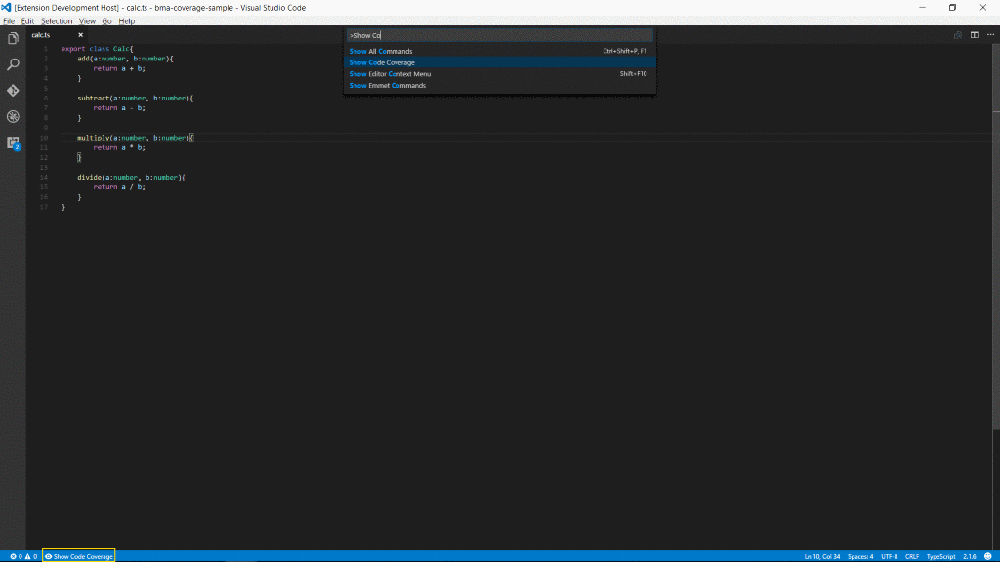

# bma-coverage

Live code coverage indication for Typescript files in VSCode from lcov.info files.

See [bma-coverage-sample](https://github.com/BrunoMartens/bma-coverage-sample) for a setup with karma + mocha + chai

## Features

Adds a button to the status bar to toggle indication



Or Ctrl + Shift + P
* Show Code Coverage
* Hide Code Coverage


## Extension Settings

Needs an entry in workspace settings.

```
{
    "bma-coverage":{
        "lcovs":[
            "./relative/path/to/lcov.info",
            ...
        ]
    }
}
```

## Known Issues

None

## Release Notes

### 0.0.1

basic functionality:
* covered: green indicator
* not covered: red indicator

## Credits
Credits due where credit's due
* Adding a convenient button in the status bar: [Bradley Meck](https://github.com/bmeck)
* using svg for gutter icons: [Matt Martz](https://github.com/entrocode)


